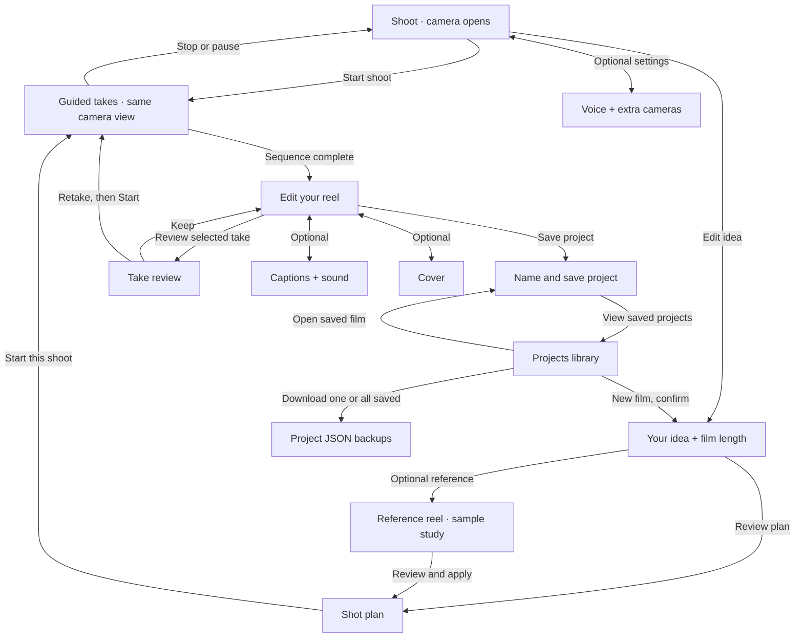

# Mini Film Director — simple screen flow

5 October 2026 (IST), pre-event design research. This is the current wireframe
screen map, not a claim of real camera or speech-model execution.

The main path is **Shoot → guided takes → Edit → Save project → Projects**.
Three bottom tabs keep the camera, current edit and saved library easy to find.
The tabs remain available on every screen; the arrows show the principal
workflow controls rather than repeating every possible tab switch.
The camera opens immediately with one cue and one Start/Stop action. The creator
can edit the idea and review the plan before starting; the default starter also
supports starting directly. Capture timing belongs to the app, not a model.

The **guided takes** node is a camera state: preparation, countdown, sample
take, timed Cut, then the next shot. The optional single-take setting pauses
for review after one take; automatic mode finishes the full plan before editing.
Stop retains an elapsed partial sample take and cancels future cues/takes.
Navigation/backgrounding cancels work. The Take review screen can Keep or
return to the shot for a retry; retry requires Start again.

The Save page saves a named snapshot and stays open. Its library link is the
next explicit action. Projects can open a saved snapshot with an unsaved-change
confirmation, or download the saved snapshot without changing the current draft.
All-project backup includes saved projects only. Reopening never starts capture
or voice. The browser library has no arbitrary count cap; quota failures preserve
previous saves. It is not cloud history, automatic save or video export.

## Progressive disclosure

| Screen | First visible | Open only when needed |
| --- | --- | --- |
| Shoot | Idea, camera, one cue, voice on/off, Start/Stop | Plan; settings; reviewed takes |
| Idea | Editable objective and length | Opening line/mood; starters/reference; scripted chat |
| Shot plan | Ordered shots, cues and durations | Camera assignments/setup; individual shot editor |
| Edit | Preview, take selection, review, Save project | Trim/angle/order/removal; captions/music/cover |
| Save | Project name, saved status and primary Save | Contents checklist and backup download |
| Projects | Saved list, search, Open/Download | Current draft panel; backup all |
| Settings | Optional voice guidance and quiet mode | Extra cameras; timing/test voice/cue history |

The model names belong to the brief and workshop notes, not a model picker in
the shooting interface. [Speech candidates](speech-models.md) propose Kokoro82M
for spoken cues and a pinned English Moonshine model for opt-in brief/transcript
input. The current simulation uses optional browser voice and editable sample
captions. It never opens the microphone or downloads/runs those checkpoints.

[Interactive flowchart](flowchart.html) starts with the main path and can show
all optional screens/return paths. Every card opens its actual prototype route.
[Standalone SVG diagram](assets/user-flow.svg) is downloadable for planning.
[Prototype](index.html#camera) and [design brief](README.md) retain the full flow.
