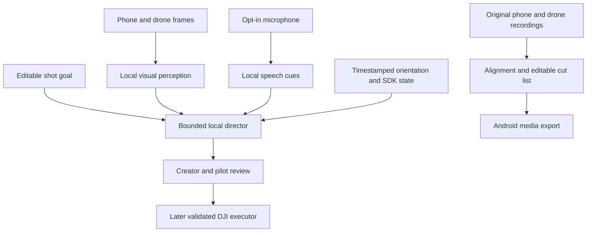

# Mini Film Director — proposed architecture

Research design, 4 October 2026 (IST). No component below is established as
implemented by this document.

Target Android for the complete app and local inference: Nothing Phone (3a) for
development, iQOO for final evidence. The [full vision](vision.md) defines dual
perspectives, opt-in speech, local direction and aligned editing. The
[product specification](product.md) covers the first workflow and
[model design](tiny-director-model.md) the initial framing head.

The first learned head reads numerical features, not raw video or free-form
language. A separate multimodal model may handle semantic critique after
validation. Plan/coverage state remains outside the framing classifier. A Kev
experiment would need a separately validated scene description and deployment;
its text decision API is not an established live-image path.

The NPU may accelerate compatible perception/director graphs. Android owns
capture, timestamps and SDK dispatch; the aircraft owns onboard stabilization.
CPU/GPU/NPU partitions and fallback must be measured. Late model outputs cannot
drive command timing. See [runtime and conversion research](vision-research.md).

## Components and boundaries

1. **Shoot state:** private brief, editable shot list, equipment assignment,
   manually reviewed clip-to-shot mapping and progress. Keep the creator's edits
   authoritative and persist without replaying actions on reopen.
2. **Director:** produces draft guidance and reasons for the next shot. Validate
   a bounded shot schema outside the model. Template/manual planning is an
   explicit fallback. Visual and text model capabilities are evaluated separately.
3. **DJI adapter:** owns SDK registration and lifecycle; exposes connection state,
   sanitized aircraft identity, read-only telemetry and preview initially. It has
   no flight executor. A future command adapter requires a separately approved,
   tested action contract and manual override.
4. **Media review:** Android photo picker imports user-selected clips; store URI
   access or bounded private proxies. Sample frames with timestamps and preserve
   orientation/aspect. Treat uncertain model findings as review suggestions.
   A sampled image cannot establish motion continuity or full-video coverage.
5. **Shoot pack:** creator selects clips and approves notes/order before export.
   Office Kit is a proposed transfer mechanism; exported files or ADB are not
   proof of that integration.
6. **Session capture, later:** phone camera, microphone and available inertial
   sensors run inside a visibly active shoot. Timestamp samples, manage backpressure
   and test concurrency with DJI preview. Use phone audio as the master track;
   keep recorded drone originals distinct from preview/analysis proxies.
7. **Assembly, later:** maintain explicit source offsets, drift corrections,
   clip in/out points and an editable cut list. Candidate Android implementation
   is [Media3 Transformer multi-asset editing](https://developer.android.com/media/media3/transformer/multi-asset).
   Measure output correctness and resource cost. A preview render or script file
   is not proof of an exported, synchronized reel.

## DJI interface selection

User confirms Neo 2 and RC-N3. [DJI's compatibility table](https://repair.dji.com/help/content?customId=01700000763&documentType=&lang=en&paperDocType=ARTICLE&re=US&spaceId=17)
lists Neo/Neo 2 as SDK-unsupported and Mini 4 Pro as Mobile SDK supported. The
adapter initially targets Mini 4 Pro + RC-N3. Neo 2 DJI Fly experiments/imports
remain distinct vendor-controlled media sources. No Fly plug-in or simultaneous
shared-transport integration is established.

[DJI's current official repository](https://github.com/dji-sdk/Mobile-SDK-Android-V5)
lists MSDK **5.18.0** and Mini 4 Pro. Start with same-version aircraft,
aircraft-provided and networkImp packages; record their resolved versions/hashes
and license notices when obtained. Vendor sample code and bundled SDK library
licensing must be assessed separately.

[SDK management](https://developer.dji.com/api-reference-v5/android-api/Components/SDKManager/DJISDKManager.html):
initialize with application context; after `INITIALIZE_COMPLETE`, call
`registerApp()`, observe registration/product callbacks. First registration
normally contacts DJI; cached registration is distinct from offline AI.

[Product keys](https://developer.dji.com/api-reference-v5/android-api/Components/IKeyManager/Key_Product_ProductKey.html)
provide `KeyConnection`, `KeyProductType` and `KeyFirmwareVersion`.
[Battery keys](https://developer.dji.com/api-reference-v5/android-api/Components/IKeyManager/Key_Battery_BatteryKey.html)
include `KeyChargeRemainingInPercent`.
[Key manager](https://developer.dji.com/api-reference-v5/android-api/Components/IKeyManager/IKeyManager.html)
supports reads/listeners; track age and detach cleanup rather than showing
cached telemetry as fresh. Do not invoke set/action APIs in the first probe.

[Camera stream API](https://developer.dji.com/api-reference-v5/android-api/Components/IMediaDataCenter/ICameraStreamManager.html):
discover camera indices with `addAvailableCameraUpdatedListener`, display using
`putCameraStreamSurface`, remove surfaces/listeners when no longer used.
Later `addFrameListener` can provide frames for algorithms; frame availability
does not prove a useful vision model. Preview pixels differ from recorded
high-resolution media; selected clip import is a separate product path.

## Android lifecycle and privacy

[DJI's sample manifest](https://github.com/dji-sdk/Mobile-SDK-Android-V5/blob/dev-sdk-main/SampleCode-V5/android-sdk-v5-sample/src/main/AndroidManifest.xml)
uses USB accessory attach handling. Follow the
[official Android accessory guidance](https://developer.android.com/develop/connectivity/usb/accessory)
for feature detection, attach/permission UI and detach. Let the SDK own
transport; do not independently claim raw USB endpoints or compete with DJI Fly.
Audit the merged manifest and runtime permission requirements for the pinned
SDK instead of copying the sample's broad storage/install/audio permissions.

The first probe remains visible and releases preview/observation on exit.
Background connection is future scope: Android's
[foreground service types](https://developer.android.com/develop/background-work/services/fgs/service-types#connected-device)
define `connectedDevice`, its permission/prerequisites and lifecycle. Camera
and microphone services have additional while-in-use restrictions; no hidden
capture/background microphone is part of the first milestone.

[Android photo picker](https://developer.android.com/training/data-storage/shared/photo-picker)
permits selected-media access without a broad gallery permission. Cloud providers
can return remote media; expose import/download state. Any external AI processing
needs an explicit media-selection/consent flow, with provenance and backend shown.
Keys and private media remain ignored; evidence logs exclude serials, GPS,
account identity and raw frames unless separately consented for local capture.
