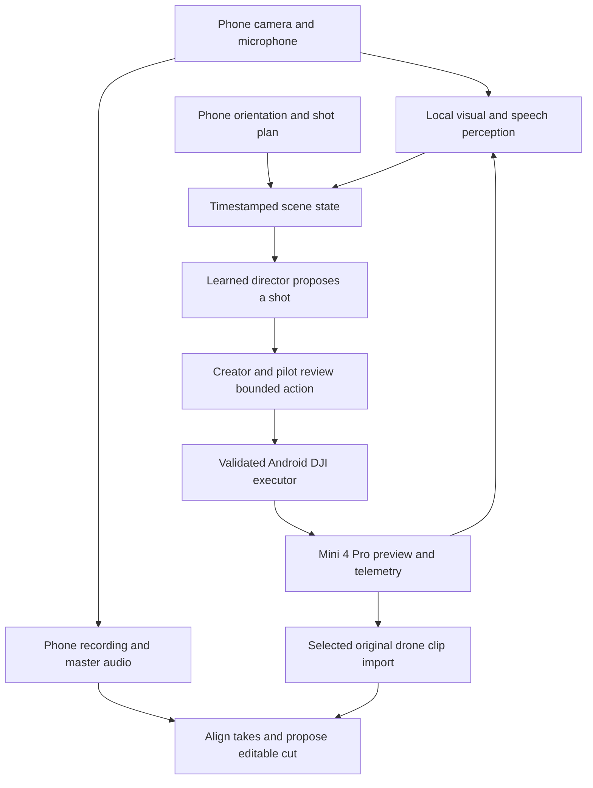

# Mini Film Director — phone and drone working as one filming unit

User-approved vision, 4 October 2026 (IST). This is pre-event research and a
delivery proposal. No app, trained model, NPU execution, drone connection or
automatic edit has been demonstrated for this product.

## The experience

The creator starts a shoot on Android and keeps talking or performing. The phone
captures one perspective and speech; a drone supplies another perspective. Local
perception and a learned director interpret spoken intent, framing and coverage,
propose useful viewpoints and coordinate approved shots. The app then aligns
the takes and proposes an editable video with continuous speech and deliberate
cuts between cameras.

First scene: a talking fashion reveal. Start on the phone's close view while the
creator explains a jacket, use a drone wide view for context, return to the phone
for a garment detail and finish on the reviewed hero shot. Movement serves the
story. Guided import/review remains the first useful delivery and recovery path;
the full vision adds local direction, bounded control and automatic assembly.

## Equipment and the SDK decision

| Item | Evidence and role | Still to establish |
| --- | --- | --- |
| DJI Neo 2 | User confirmed exact model; built-in filming experiments through DJI Fly | Firmware, connection and Digital Transceiver availability |
| DJI Mini 4 Pro | User reports ownership; custom SDK-control target | Firmware, current pairing and bench connection |
| RC-N3 | User confirmed phone-holder remote; Android connection route | Data cable and Mini 4 Pro pairing |
| Screen-equipped remote | User reports ownership | Exact model; custom app installation/support not assumed |
| Nothing Phone (3a) | Confirmed Android development phone | Actual OS/RAM, permissions and concurrent performance |
| iPhone with DJI Fly | Reported optional reference equipment | No iOS app planned |
| iQOO demo phone | Required final hardware | Exact model/SoC and access unknown |

[Nothing's specifications](https://in.nothing.tech/products/phone-3a) identify
Snapdragon 7s Gen 3. The eventual iQOO needs separate compilation and measurements.
Google's [current LiteRT Qualcomm support list](https://developers.google.com/edge/litert/next/qualcomm)
does not list 7s Gen 3. That route's compatibility on Phone (3a) is unresolved;
establish local CPU/GPU behavior separately and verify the iQOO NPU path on its
actual chip. This does not establish the absence of NPU hardware in Phone (3a).

[DJI's current compatibility table](https://repair.dji.com/help/content?customId=01700000763&documentType=&lang=en&paperDocType=ARTICLE&re=US&spaceId=17)
lists **Neo and Neo 2 as SDK-unsupported**, and **Mini 4 Pro as Mobile SDK supported**.
The [Android V5 repository](https://github.com/dji-sdk/Mobile-SDK-Android-V5)
also lists Mini 4 Pro. Neo 2 working in DJI Fly does not establish custom control.

Use Neo 2 to explore vendor filming features and obtain selected footage.
[DJI's Neo 2 FAQ](https://www.dji.com/nl/neo-2/faq) describes mobile/voice features
and phone audio through DJI Fly; its RC route requires the Digital Transceiver.
Those are DJI features, not access granted to our model. Use Mini 4 Pro + RC-N3
for the independent custom SDK probe. No new drone purchase is needed for that
route. Neo 2 custom control is blocked pending a supported interface.

DJI Fly and our SDK app are distinct operating modes. Our app owns its SDK
connection; no documented plug-in/control bridge into Fly has been established.
Do not depend on both apps sharing transport or silently automate Fly's UI.

## What the inputs contribute

| Input | Contribution | Boundary |
| --- | --- | --- |
| Phone camera | Close view, person/garment framing | Place it where it sees the creator; use one phone camera initially |
| Drone preview | Wide view and subject framing | Preview differs from original recorded media; hidden sensing cameras are not assumed accessible |
| Phone microphone | Intent, speech timing and master audio | Noise/recognition need testing; sound is not a second visual angle |
| Phone inertial sensors | Phone tilt/orientation/motion diagnostics | They do not locate the drone relative to the person |
| SDK telemetry | Available aircraft state and freshness | Validate availability and coordinate interpretation |
| Plan and coverage | Requested, captured and accepted shots | Creator corrections remain authoritative |

Camera/microphone operate only in a visibly active, explicitly started shoot
with a stop control and normal Android permissions. Discover available sensors.
Start with speech activity and explicit cues; semantic intent needs local speech
recognition. Android's [SpeechRecognizer](https://developer.android.com/reference/android/speech/SpeechRecognizer)
offers an on-device availability check; a default recognizer is not proof of
offline processing. Retain typed cues when recognition is unavailable.

## Local models and execution

The NPU accelerates supported inference graphs. Android handles sensors,
timestamps, validation and SDK dispatch; the drone retains onboard flight
stabilization. Decode/encode/editing use the media pipeline. Every operation does
not need to pass through an NPU. [Runtime research](vision-research.md) describes
Qualcomm options and required backend evidence.

Perception produces bounded scene state: framing, intended shot, speech cue,
coverage, confidence and input age. Compare rules with the
[tiny numerical framing head](tiny-director-model.md). Separately, fine-tune a
compatible released [Kev checkpoint](https://github.com/jaredpalmer/kev) on
creator-labelled textual scene states and shot choices. Train on the laptop;
compare with the untouched checkpoint and rules on separate whole shoots.
Kev's text decisions and numerical framing suggestions are distinct experiments.

Verify faithful Android probability outputs, including after quantization, before
attempting NPU compilation. Actual operators, backend logs and sustained device
measurements decide whether it works. No Kev Android/NPU port is established.
A distilled small model is an alternative only with measured comparison and clear
provenance; it is not automatically Kev itself. Images need separate perception.

The executor turns a specifically approved proposal into bounded SDK operations.
Fresh state, limits, command expiry, manual takeover and behavior on app/link
failure must be tested outside AI. A late inference result cannot trigger overdue
movement; low-level command timing cannot wait on an LLM. Any future sequence
must enumerate and approve each action and its limits before execution.

## Build steps and stop/go gates

| Order | Work | Evidence needed to continue |
| --- | --- | --- |
| 0 | Inventory and SDK feasibility | Confirmed equipment and official support distinction recorded; physical setup still untested |
| 1 | Explore Neo 2 in DJI Fly | User verifies vendor preview/basic controls and obtains selected footage; no custom-control claim |
| 2 | Independent Mini 4 Pro probe | Registered package/key, real identity, fresh telemetry, changing preview and detach/reconnect with propellers removed and zero flight/capture actions |
| 3 | Phone camera/audio plus timestamped preview | Explicit start/stop and permissions, concurrent streams without starving connection/UI, originals distinguished from proxies |
| 4 | Local perception in advice mode | Offline processing after setup, measured uncertainty/staleness behavior, manual fallback; no model flight commands |
| 5 | Train and compare director models | Whole-shoot train/validation/test split; useful improvement over rules/untouched checkpoint, failures reported |
| 6 | Android deployment and NPU | Output parity, latency/RAM/thermals, actual backend/fallback logs; repeat on iQOO |
| 7 | Bounded SDK capture/control | Action-level pilot approval, validated limits, takeover/watchdog/failure behavior; one operation at a time |
| 8 | First editable reel | Continuous phone speech, aligned original camera clips, correct cut/crop and Android export playback |
| 9 | Complete demo | Repeatable dual-view performance, learned review and final video on required iQOO; actual Office Kit transfer and permitted venue demo |

Steps 1 and 2 are independent. Training is not needed to prove SDK connection.
NPU work starts with compatible small perception graphs and a CPU reference.
If Neo 2 support remains unavailable, it stays a vendor-controlled media source.
If a control/backend gate fails, preserve useful review/editing and disclose the
gap. Imported footage cannot establish live AI drone control. No flight action
is part of the first connection probe.

## Stitching the performance

Use phone speech as master audio. Different camera start offsets and drift need
measurement; shared session metadata alone does not prove synchronization. Begin
with a visible sync cue in both views and phone audio, permit manual alignment
and test longer takes. Do not assume drone footage contains matching speech.

Create a reviewed cut list: source clip, in/out points, intended shot and reason.
Start with straight cuts between aligned views and continuous speech. Android
[Media3 Transformer](https://developer.android.com/media/media3/transformer) and
[multi-asset editing](https://developer.android.com/media/media3/transformer/multi-asset)
are candidates for sequences, trimming/effects and export; codecs, performance
and output still require real-device tests. A different take cannot be presented
as the simultaneous second view of the same performance. Preserve originals.

## First convincing demonstration

Use a short talking fashion reveal, fixed phone close view and one drone wide
view. Begin flight experiments with a separate human pilot. Show local intent
and framing advice, a missing/poor shot, a reviewed pickup, then an aligned cut
and export. Label who flew, which model/backend ran and which parts were automatic.
The fully solo adaptive cameraman is the long-term vision; claim only passed gates.

Keep preparation/prototypes under event provenance rules; event competition
source must be newly created unless organizers approve reuse. Keep footage,
data, weights and keys private, below the 10 GB aim/15 GB cap. The missing old
full backup remains a separate recovery issue. See [product](product.md),
[delivery plan](../plan.md) and [verified status](status.md).
